# Sanctum Vault — Zero‑Knowledge Password & Data Vault

Sanctum Vault is a zero‑knowledge encrypted password and data vault focused on providing a simple, secure way to store and share sensitive information. The project demonstrates secure design patterns, modular Flask app structure, and common UX flows for vault management and admin oversight.

## Purpose

## Tech stack


## Screenshots

### Landing page

The landing page introduces Sanctum Vault's zero-knowledge security model and provides entry points for users, administrators, and new account registration.

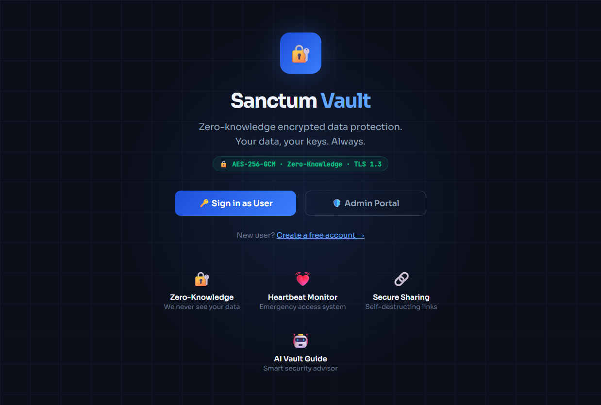

### User sign-in

The sign-in page gives returning users access to their encrypted vault with their email address and master password.

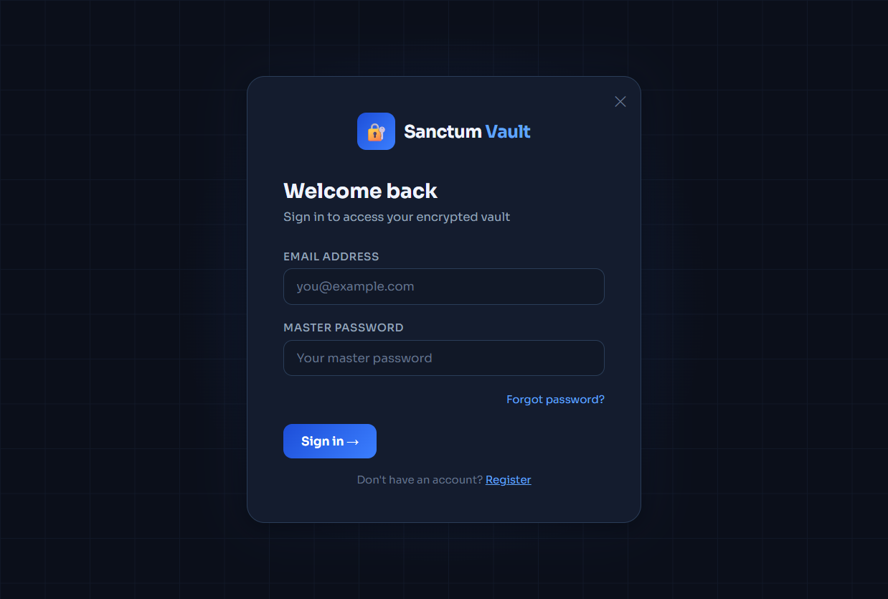

### Authenticated workspace

The logged-in workspace brings vault management, security monitoring, and sharing into one focused navigation shell. The dashboard summarizes encrypted item counts, active shares, heartbeat status, breach exposure, and recent account activity.

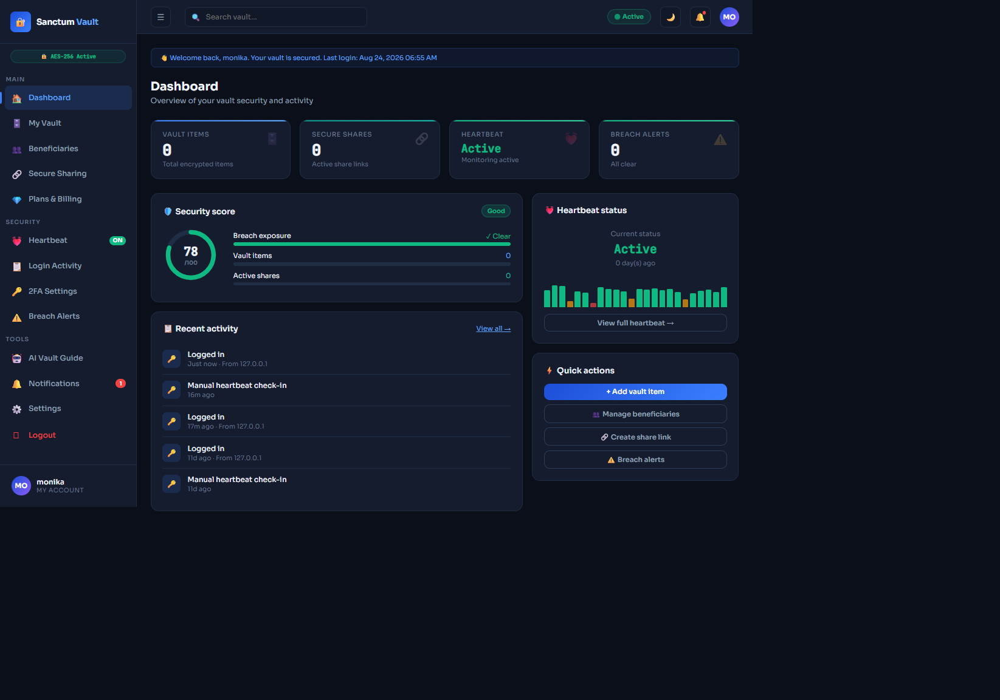

### Encrypted vault

The vault organizes protected passwords, documents, notes, and cards by category. New installations begin with a clear empty state and a direct action for adding the first item.

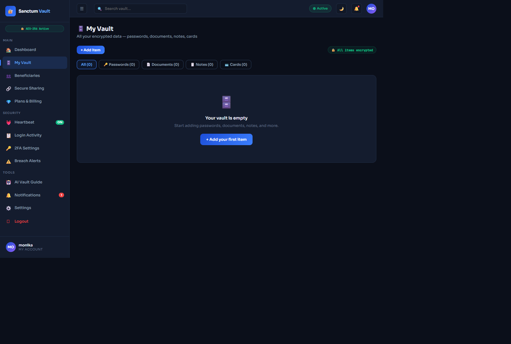

### Secure sharing

Secure sharing provides time-limited, self-destructing links for sharing encrypted vault items.

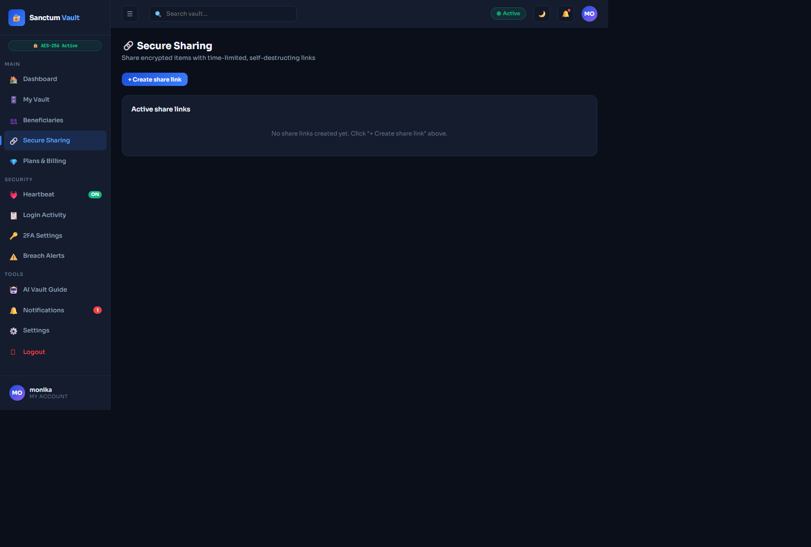

### Heartbeat monitoring

Heartbeat monitoring tracks check-ins and can alert trusted contacts after the configured inactivity interval.

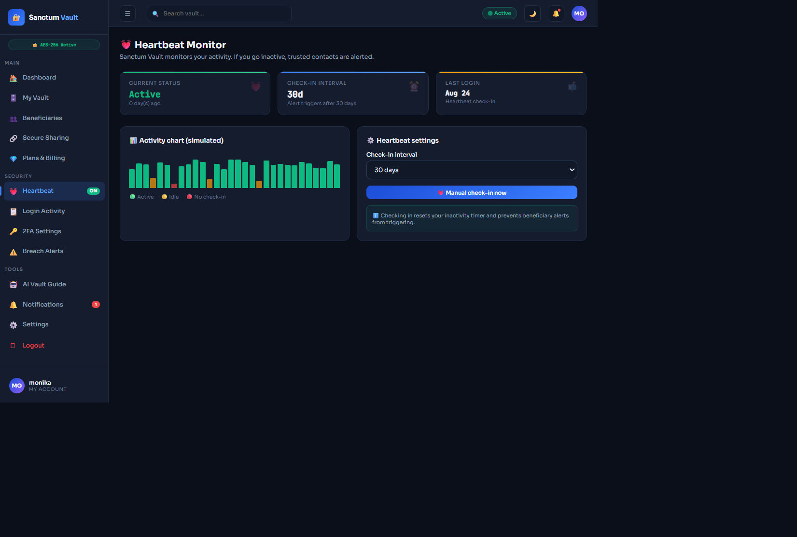


## Admin panel

The restricted admin panel gives authorized administrators a centralized view of platform health, account activity, and security events. Admin sessions are logged and audited.

### Admin dashboard

The admin dashboard summarizes registered users, active accounts, vault usage, payments, threats, recent registrations, and recent events.

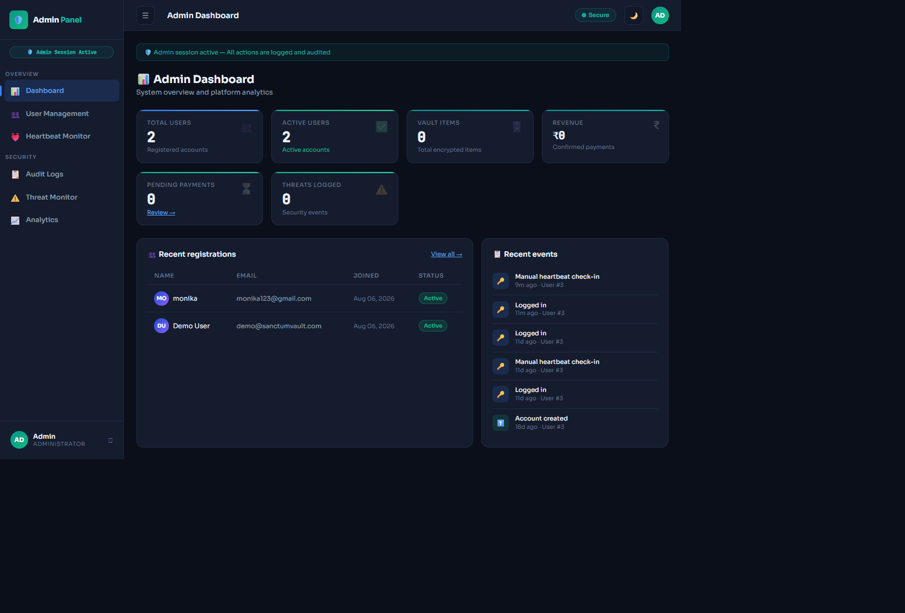

### User management

User management provides searchable account listings with plan, activity, status, and moderation controls.

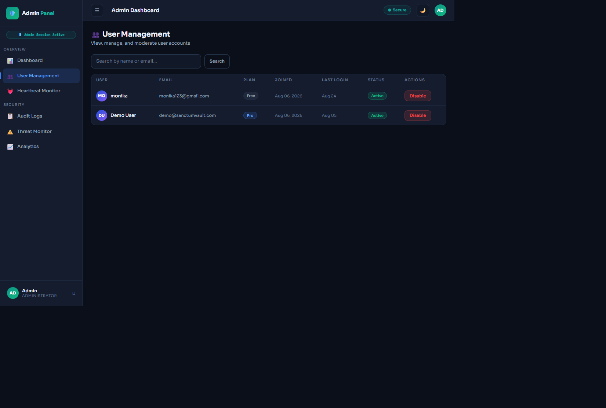

### Admin heartbeat monitor

The admin heartbeat monitor compares user check-in activity, inactivity duration, account status, and alert intervals across the platform.

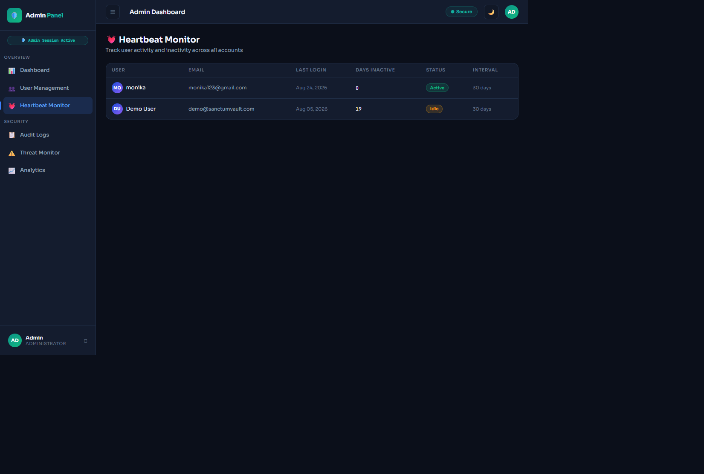

### Audit logs

Audit logs provide a chronological record of administrative and user security events for review and accountability.

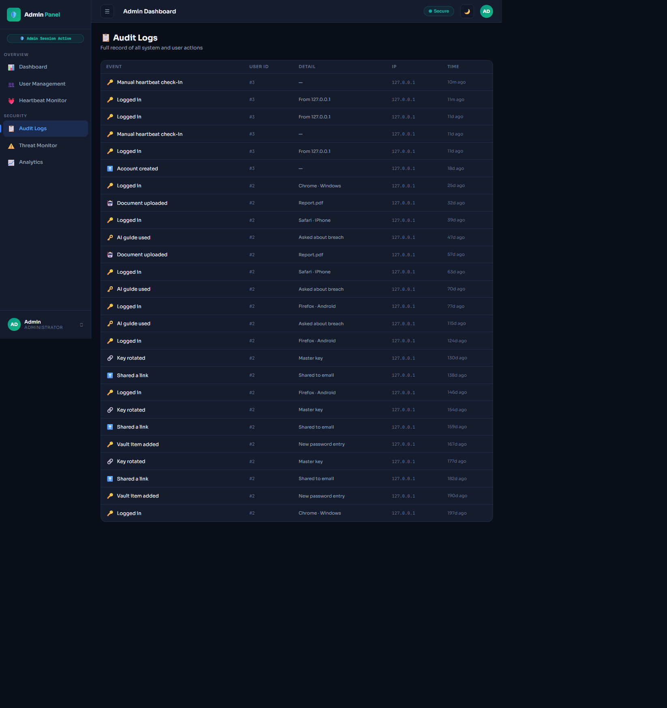

### Threat monitor

The threat monitor surfaces suspicious activity and current security alerts across all accounts.

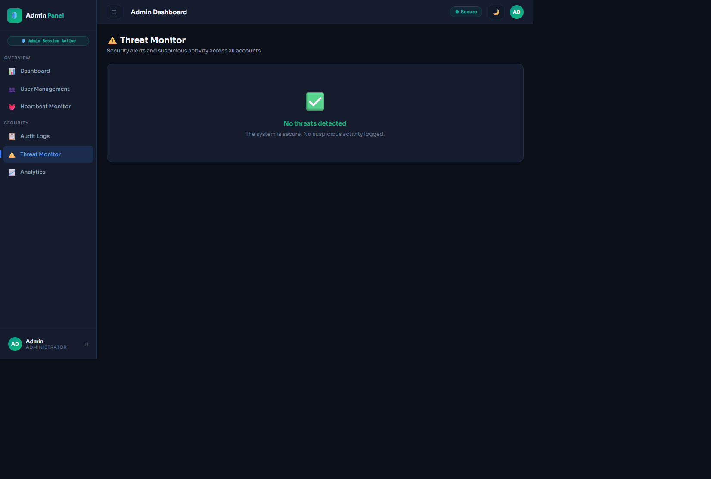

### Analytics

Analytics presents platform-wide usage trends, vault statistics, and encryption coverage metrics.

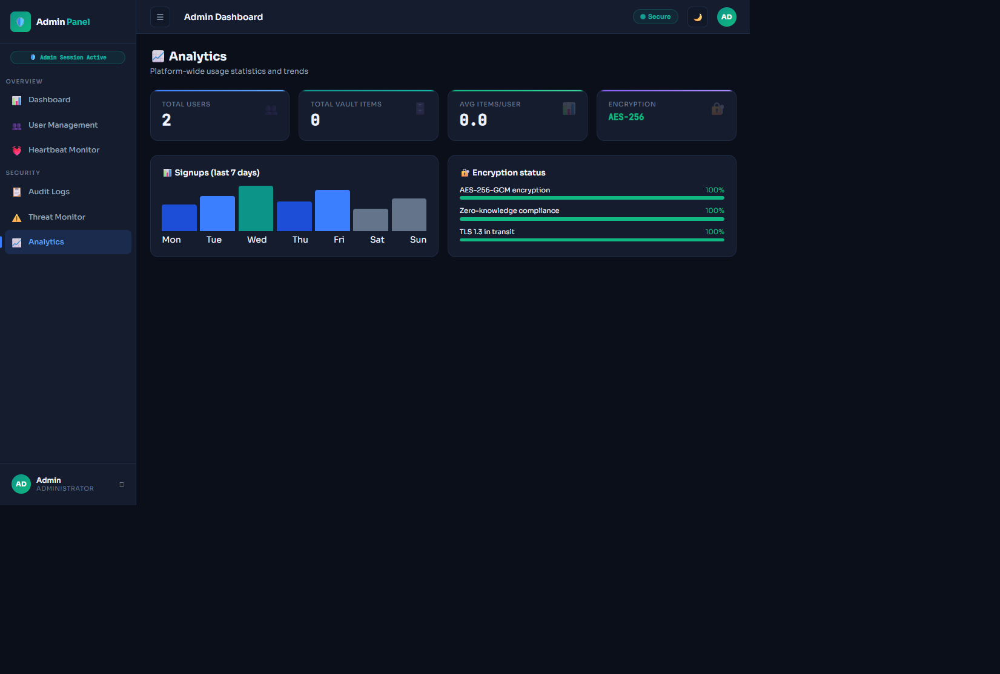


## Run locally (Windows PowerShell)
1. Open PowerShell and change to the project directory:
```powershell
Set-Location "C:\Users\ADMIN\Desktop\sv\sanctum-vault"
```
2. Create and activate a virtual environment:
```powershell
python -m venv venv
venv\Scripts\Activate.ps1
```
3. Install dependencies:
```powershell
python -m pip install --upgrade pip
python -m pip install -r requirements.txt
```
4. (Optional) Set environment variables for development:
```powershell
#$env:SECRET_KEY = 'change-me-for-local'
#$env:DATABASE_URL = 'sqlite:///instance/dev.db'
$env:FLASK_ENV = 'development'
```
5. Initialize the database (the app seeds demo/admin users automatically on first run):
```powershell
# If your setup requires a manual step, run it here. Otherwise skip.
```
6. Start the development server:
```powershell
python app.py
```
7. Open your browser and visit:

http://127.0.0.1:5000

Notes for macOS/Linux: use `source venv/bin/activate` to activate the venv and `python3` if `python` points to Python 2.


## Default credentials (development only)

Register a new user through the UI to test normal user flows.


## Project structure (overview)
```
sanctum-vault/
├── app.py              # Flask application and routes
├── database.py         # Models and DB helpers
├── requirements.txt    # Python dependencies
├── instance/           # runtime files (uploads, sqlite db)
├── static/             # CSS, JS, images
└── templates/          # Jinja2 templates
```


## Key features

- User registration, sign-in, logout, password changes, and session-based access control.
- Vault management for passwords, documents, notes, cards, and identity records, with editing, soft deletion, file uploads, and downloads.
- Generated passwords and secure sharing links with expiration, view limits, revocation, and self-destruct behavior.
- Beneficiary management for delayed access and heartbeat check-ins with inactivity notifications.
- Security center with breach status, notifications, activity history, and configurable two-factor authentication using TOTP, SMS OTP, hardware-key registration, and backup codes.
- Plan selection, payment records, and user payment history.
- Restricted admin panel with dashboard metrics, user management, heartbeat monitoring, threat monitoring, analytics, payments, and audit logs.
- Responsive Flask/Jinja interface with dedicated user and administrator shells.

## Security notes

- User passwords are stored as Werkzeug password hashes rather than plaintext passwords.
- Authenticated routes use login and administrator role guards, and vault records are queried against the current user where applicable.
- Session cookies are configured with `HttpOnly` and `SameSite=Lax` attributes. Set a strong `SECRET_KEY` through the environment before deployment.
- Uploaded files are limited to 16 MB, checked against an allowlist of extensions, and renamed with Werkzeug's `secure_filename` helper.
- Share links support expiration, maximum-view limits, and manual revocation. Treat generated share URLs as sensitive credentials.
- Two-factor options and hashed backup codes are available, but they should be enabled and tested as part of deployment configuration.
- This repository is a demonstration and is not production-ready by default. The development fallback secret, seeded demo credentials, simulated payment/SMS/hardware-key integrations, and local SQLite configuration must be replaced before deployment.
- Review the vault encryption boundary before handling real secrets. The current application model labels the stored field `encrypted_value`, but production use requires verified client-side encryption and careful key-management design.
- Enable HTTPS, secure cookies, CSRF protection, rate limiting, secure upload storage, dependency updates, and external secret management in a production deployment.

## Conclusion
Sanctum Vault provides a practical foundation for securely managing sensitive data, sharing it when needed, and monitoring access through administrative tools. Before production use, review the security configuration and replace all development credentials and demo integrations.
# sanctum-vault
